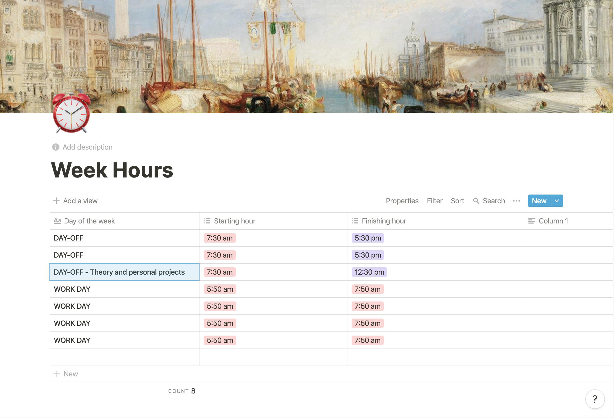
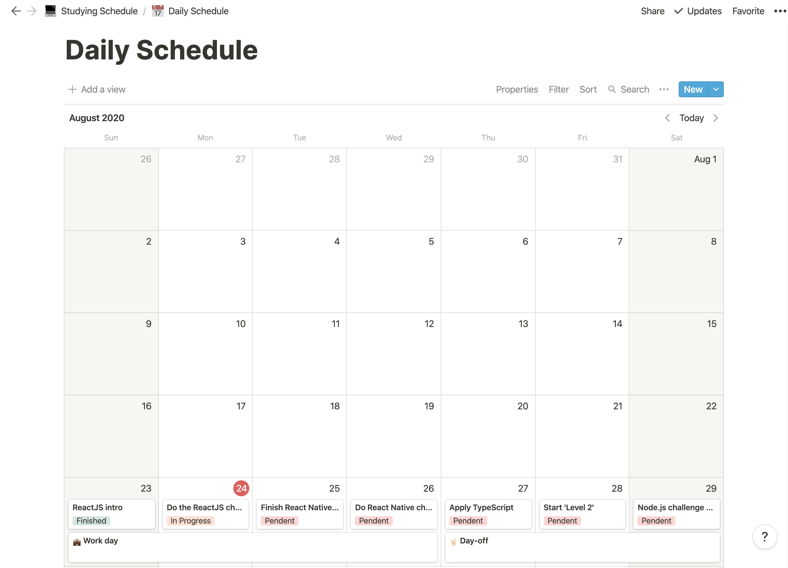

<h3 align="center">
  Challenge 01: Planning my studies
</h3>

<blockquote align="center">“Your only limitation is yourself”!</blockquote>

## :rocket: About the challenge

In this challenge, I must plan my studies.

For that, I had to create a chronogram that will be adapted according to my time and rhythm.

Define what'll be my study schedule, creating tasks that will be attached to a calendar, to help me study and always be aligned with my goals!

### Defining a weekly schedule

  

In this section I must inform my schedule, the time I will dedicate for my journey as a developer, after all, the studies routine will be the first step in order to achieve my goals as quickly as possible!

### Defining a daily schedule

  

Here I must plan my daily tasks so I can be prepared to all the content that I'll consume during the week.
