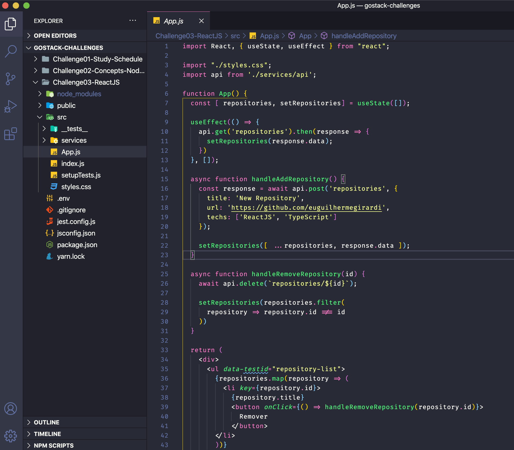

<h3 align="center">
  Desafio 03: ReactJS Concepts
</h3>

<blockquote align="center">“Do your best, but always on time”!</blockquote>

## :rocket: Sobre o desafio

In this challenge, I must create an application to practice what I have learned in ReactJS!

Now I must continue to develop the application that will store your portfolio repositories, which I already developed the backend in the last challenge using Node.js.

### Application features

- **`List your API` ** repositories: You should be able to create a list with the ** title ** field of all repositories that are registered in your API.

- **`Add a repository to your API` **: You should be able to add a new item to your API via a button with the text ** Add ** and, after creation, you should be able to display its name after the register.

- **`Remove a repository from your API` **: For each item on your list, you must have a button with the text ** Remove ** that, when clicked, will call a function to remove that item from the list on your frontend and your API.

### Testing specification

In each test, you have a brief description of what your application must do in order for the test to pass.

For this challenge we have the following tests:

- **`should be able to add new repository`**: For this test to pass, your application must allow a repository to be added to your backend and listed on your frontend within a `LI`.

- **`should be able to remove repository`**: In order for this test to pass, your application must allow that when clicking on the remove button that will be inside the `LI` of the added repository, the item will be removed from the list.

  

